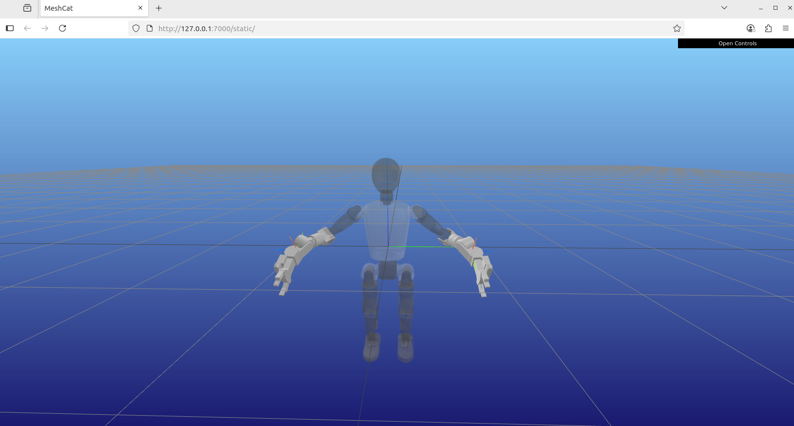

# 0 Introduction

This repository implements **teleoperation** control of a **Booster  robot T1(7dof arm)** using Apple Vision Pro.  

We developed an APP using Swift as the UI interface for user operations, and also used this APP to enable communication between Apple Vision Pro and the robot. The APP can transmit the wrist pose information  recognized by Apple Vision Pro to the robot, and perform real-time  rendering of the video stream information from the robot's camera.

我们使用swift开发了一个APP作为用户操作的UI界面，同时也借用该APP实现Apple Vision Pro 与机器人之间的通讯。APP可以将Apple Vision Pro识别的手腕位姿信息传递给机器人，并将机器人相机视频流信息进行实时渲染


# 硬件需求


# 1 代码部署

## 1.1 环境配置

1. 从[T1说明书-V1.1](https://booster.feishu.cn/wiki/UvowwBes1iNvvUkoeeVc3p5wnUg)获取booster_robotics_sdk_release库(指定遥操分支)，然后参考`README.md` 把python binding api 安装到本地

   ```bash
   git clone https://e.coding.net/generate-gjjleqkqwr/booster-robotics/booster_robotics_sdk_release.git # Please refer to the address on the "T1说明书-V1.1"
   cd booster_robotics_sdk_release
   git checkout ***
   
   # 编译安装 python binding api sdk到本地
   sudo ./install.sh
   pip3 install pybind11
   pip3 install pybind11-stubgen
   mkdir build
   cd build
   cmake .. -DBUILD_PYTHON_BINDING=on
   make
   sudo make install
   
   # if pybind11-stubgen cannot be found even after pip install, export PATH
   # ```bash
   # export PATH=/home/[user name]/.local/bin:$PATH
   # ```
   ```
   
2. 进入[booster_avp_teleop](https://github.com/LufanM/booster_avp_teleop)项目目录，将avp_teleop的包安装到本地，用于apple vision pro的通讯

   ```bash
   git clone https://github.com/LufanM/booster_avp_teleop
   cd booster_avp_teleop
   pip install -e .
   ```

3. 安装apple vision pro的APP，用于UI交互，在该APP中启动apple vision pro的数据传输，机器人头部相机视频流实时渲染，具体安装请参考[how_to_install_avp_app.md](./how_to_install_avp_app.md)

4. 本仓库使用了[pinocchio](https://github.com/stack-of-tasks/pinocchio)库进行ik解算，需安装pinocchio环境，然而目前booster_robotics_sdk_release的python binding api不支持安装在conda的环境中，所以请把pinocchio库安装到本地环境，不要使用conda-forge把库安装到虚拟环境

   * **注意：**在本地环境中，需要进行如下安装，请不要用`pin install pin`对pinocchio库进行安装，否则无法导入casadi库，如下：类似问题参考pinocchio[官网Issue](https://github.com/stack-of-tasks/pinocchio/issues/2733)
   
   ```bash
   Traceback (most recent call last):
     File "/home/master/Downloads/mo/booster_avp_teleop/booster_teleop/robot_arm_ik/booster_ik.py", line 6, in <module>
       from pinocchio import casadi as cpin
   ImportError: cannot import name 'casadi' from 'pinocchio' (/home/master/.local/lib/python3.10/site-packages/cmeel.prefix/lib/python3.10/site-packages/pinocchio/__init__.py)
   ```
   
   * 所以请使用官网提供的[linux](https://stack-of-tasks.github.io/pinocchio/download.html)安装步骤，**通过robotpkg**把pin安装下来，别忘记把环境变量导入`~/.bashrc`文件中
   
   ```bash
   source ~/.bashrc
   ```
   
   * 测试pinocchio环境，会得到meshcat渲染的可视化环境
   
   ```bash
   cd booster_teleop/robot_arm_ik
   python booster_ik.py
   ```
   
   

## 1.2 启动遥操


# 2 Vison Pro APP 

## 2.1 Introduction

This App develepment is based on open source repo [VisionProTeleop](https://github.com/Improbable-AI/VisionProTeleop).  Made for the Booster T1 robot(7dof arm). On the basis of the original app, we have added the first-person view of the robot's head camera.


## 2.2 How to Use

**Step 1. Install the app on Vision Pro** 


This app is now officially on VisionOS App Store! You can search for **[Tracking Streamer](https://apps.apple.com/us/app/tracking-streamer/id6478969032)** from the App Store and install the app. 

If you want to play around with the app, you can build/install the app yourself too. To learn how to do that, take a look at this [documentation](/how_to_install.md). This requires (a) Apple Developer Account, (b) Vision Pro Developer Strap, and (c) a Mac with Xcode installed. 

**Step 2. Run the app on Vision Pro** 

After installation, click on the app on Vision Pro and click `Start`. That's it!  Vision Pro is now streaming the tracking data over your wifi network. 

**Tip**  Remember the IP address before you click start; you need to specify this IP address to subscribe to the data. Once you click start, the app will immediately enter into pass-through mode. Click on the digital crown to stop streaming.  

**Step 3. Receive the stream from anywhere**

The following python package allows you to receive the data stream from any device that's connected to the same WiFi network. First, install the package: 

```
cd booster_avp_teleop
pip install -e .
```

Then, add this code snippet to any of your projects you were developing: 

```python
from avp_teleop import VisionProStreamer
avp_ip = "10.31.181.201"   # example IP 
s = VisionProStreamer(ip = avp_ip, record = True)

while True:
    r = s.latest
    print(r['head'], r['right_wrist'], r['right_fingers'])
```

## 2.3 Available Data

```python
r = s.latest
```

`r` is a dictionary containing the following data streamed from AVP: 

```python
r['head']: np.ndarray  
  # shape (1,4,4) / measured from ground frame
r['right_wrist']: np.ndarray 
  # shape (1,4,4) / measured from ground frame
r['left_wrist']: np.ndarray 
  # shape (1,4,4) / measured from ground frame
r['right_fingers']: np.ndarray 
  # shape (25,4,4) / measured from right wrist frame 
r['left_fingers']: np.ndarray 
  # shape (25,4,4) / measured from left wrist frame 
r['right_pinch_distance']: float  
  # distance between right index tip and thumb tip 
r['left_pinch_distance']: float  
  # distance between left index tip and thumb tip 
r['right_wrist_roll']: float 
  # rotation angle of your right wrist around your arm axis
r['left_wrist_roll']: float 
 # rotation angle of your left wrist around your arm axis
```


### 2.4 Axis/Frame Convention

Refer to the image below to see how the axis are defined for your head, wrist, and fingers. 


### 2.5 Hand Skeleton used in VisionOS


Refer to the image above to see what order the joints are represented in each hand's skeleton. 

# 3 数据采集


# 4 Acknowledgements 

This is partially adopted from https://github.com/Improbable-AI/VisionProTeleop
