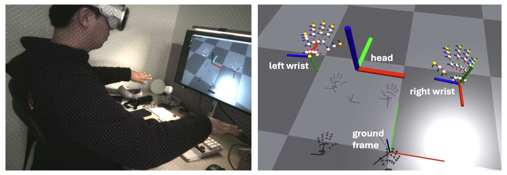

# 0 Introduction

This repository implements **teleoperation** control of a **Booster  robot T1(7dof arm)** using Apple Vision Pro.  

We developed an APP using Swift as the UI interface for user operations, and also used this APP to enable communication between Apple Vision Pro and the robot. The APP can transmit the wrist pose information  recognized by Apple Vision Pro to the robot, and perform real-time  rendering of the video stream information from the robot's camera.

我们使用swift开发了一个APP作为用户操作的UI界面，同时也借用该APP实现Apple Vision Pro 与机器人之间的通讯。APP可以将Apple Vision Pro识别的手腕位姿信息传递给机器人，并将机器人相机视频流信息进行实时渲染


# 1 Vison Pro APP

## 1.1 Introduction

This App develepment is based on open source repo [VisionProTeleop](https://github.com/Improbable-AI/VisionProTeleop).  Made for the Booster T1 robot(7dof arm). On the basis of the original app, we have added the first-person view of the robot's head camera.


## 1.2 How to Use

**Step 1. Install the app on Vision Pro** 


This app is now officially on VisionOS App Store! You can search for **[Tracking Streamer](https://apps.apple.com/us/app/tracking-streamer/id6478969032)** from the App Store and install the app. 

If you want to play around with the app, you can build/install the app yourself too. To learn how to do that, take a look at this [documentation](/how_to_install.md). This requires (a) Apple Developer Account, (b) Vision Pro Developer Strap, and (c) a Mac with Xcode installed. 

**Step 2. Run the app on Vision Pro** 

After installation, click on the app on Vision Pro and click `Start`. That's it!  Vision Pro is now streaming the tracking data over your wifi network. 

**Tip**  Remember the IP address before you click start; you need to specify this IP address to subscribe to the data. Once you click start, the app will immediately enter into pass-through mode. Click on the digital crown to stop streaming.  

**Step 3. Receive the stream from anywhere**

The following python package allows you to receive the data stream from any device that's connected to the same WiFi network. First, install the package: 

```
cd booster_avp_teleop
pip install -e .
```

Then, add this code snippet to any of your projects you were developing: 

```python
from avp_teleop import VisionProStreamer
avp_ip = "10.31.181.201"   # example IP 
s = VisionProStreamer(ip = avp_ip, record = True)

while True:
    r = s.latest
    print(r['head'], r['right_wrist'], r['right_fingers'])
```

## 1.3 Available Data

```python
r = s.latest
```

`r` is a dictionary containing the following data streamed from AVP: 

```python
r['head']: np.ndarray  
  # shape (1,4,4) / measured from ground frame
r['right_wrist']: np.ndarray 
  # shape (1,4,4) / measured from ground frame
r['left_wrist']: np.ndarray 
  # shape (1,4,4) / measured from ground frame
r['right_fingers']: np.ndarray 
  # shape (25,4,4) / measured from right wrist frame 
r['left_fingers']: np.ndarray 
  # shape (25,4,4) / measured from left wrist frame 
r['right_pinch_distance']: float  
  # distance between right index tip and thumb tip 
r['left_pinch_distance']: float  
  # distance between left index tip and thumb tip 
r['right_wrist_roll']: float 
  # rotation angle of your right wrist around your arm axis
r['left_wrist_roll']: float 
 # rotation angle of your left wrist around your arm axis
```


### 1.4 Axis/Frame Convention

Refer to the image below to see how the axis are defined for your head, wrist, and fingers. 




### 1.5 Hand Skeleton used in VisionOS


Refer to the image above to see what order the joints are represented in each hand's skeleton. 


# 硬件需求


# 2 环境安装

## 2.1 安装步骤

1.  从[T1说明书-V1.1](https://booster.feishu.cn/wiki/UvowwBes1iNvvUkoeeVc3p5wnUg)获取booster_robotics_sdk库(指定遥操分支)，参考`README.md`把python binding api 安装到本地

2. 将avp_teleop的包安装到本地，用于avp的通讯，进入[booster_avp_teleop](https://github.com/LufanM/booster_avp_teleop)项目目录

   ```bash
   pip install -e .
   ```

3. 参考AVP的APP安装，将app安装至AVP中，具体安装请参考how_to_install_avp_app.md

4. 该仓库使用了[pinocchio](https://github.com/stack-of-tasks/pinocchio)库进行ik解算，所以需要安装pinocchio环境，目前booster_robotics_sdk的python binding api不支持安装在conda的环境中，所以请把pinocchio库安装到本地环境，具体安装请参考章节2

   

## 2.2 pinocchio环境安装及问题解决

### 2.2.1 安装步骤：

* 在虚拟环境中，直接使用conda-forge进行安装，不会有啥依赖问题，直接：`conda install pinocchio=3.1.0 numpy=1.26.4 -c conda-forge`即可

* 在本地环境中，需要进行如下安装，会出现较多依赖问题：该仓库需要用该库进行优化求解，pinocchio对该库进行了嵌入所以

  1. `pip install pin==3.7.0`，把pinocchio库需要的依赖会一并安装。

  2. 安装一些工具库

     ```
     `pip install casadi==3.7.0  meshcat==0.3.2`
     ```

  3. 运行程序 `python booster_ik.py`会发现报错

     ```
     Traceback (most recent call last):
       File "/home/master/Downloads/mo/booster_avp_teleop/booster_teleop/robot_arm_ik/booster_ik.py", line 6, in <module>
         from pinocchio import casadi as cpin
     ImportError: cannot import name 'casadi' from 'pinocchio' (/home/master/.local/lib/python3.10/site-packages/cmeel.prefix/lib/python3.10/site-packages/pinocchio/__init__.py)
     ```

     按照如下2.2.2.2的解法进行解决。

  

### 2.2.2 问题及解决办法：

在进行本地环境安装时，踩了不少依赖的坑。具体问题及解决办法如下：

#### 2.2.2.1 包冲突问题：

* 按照[pinocchio](https://stack-of-tasks.github.io/pinocchio/download.html)官网安装pin，参考官网使用：`python3 -m pip install pin==3.7.0`

并且安装一些依赖库后版本为：`pin==3.7.0  numpy==1.26.4 cmeel-boost==1.87.0.1`但是会报错 ，

```bash
cmeel-boost 1.87.0.1 has requirement numpy<2.4,>=2.2; python_version >= "3.10.0", but you have numpy 1.26.4.
```

可以忽略。通常安装cmeel-boost的时候会自动安装numpy>2.2以上的版本，但是我们的程序很多都是在1.2*版本下编译的会出错，这种情况直接`pip3 install numpy==1.26.4`即可，忽略上述报错。

* 如果采用降级cmeel-boost来解决numpy的冲突，会带来新的问题。如果cmeel-boost低于1.87会出现很多依赖冲突，如下：故建议采用上述方法解决，当然如果你有好的解决numpy冲突问题，欢迎留言。作者暂时没有好的办法解决，好在不影响实机的程序执行。

```bash
ERROR: pip's dependency resolver does not currently take into account all the packages that are installed. This behaviour is the source of the following dependency conflicts.
coal 3.0.1 requires eigenpy<4,>=3.10, but you have eigenpy 3.5.1 which is incompatible.
coal-library 3.0.1 requires eigenpy<4,>=3.10, but you have eigenpy 3.5.1 which is incompatible.
eigenpy 3.5.1 requires cmeel-boost~=1.83.0, but you have cmeel-boost 1.87.0.1 which is incompatible.
hpp-fcl 2.4.4 requires cmeel-boost~=1.83.0, but you have cmeel-boost 1.87.0.1 which is incompatible.
```

#### 2.2.2.2 报错无法从pinocchio中找到casadi：

```bash
Traceback (most recent call last):
  File "/home/master/Downloads/mo/booster_avp_teleop/booster_teleop/robot_arm_ik/booster_ik.py", line 6, in <module>
    from pinocchio import casadi as cpin
ImportError: cannot import name 'casadi' from 'pinocchio' (/home/master/.local/lib/python3.10/site-packages/cmeel.prefix/lib/python3.10/site-packages/pinocchio/__init__.py)
```

或者

```bash
ImportError: /lib/x86_64-linux-gnu/libstdc++.so.6: version `GLIBCXX_3.4.31' not found (required by /home/molufan/.local/lib/python3.10/site-packages/cmeel.prefix/lib/python3.10/site-packages/pinocchio/../../.././libboost_filesystem.so.1.86.0)
```

**解决方法：**

尝试安装包来解决这个问题我是失败了。

所以参考官网的[linux](https://stack-of-tasks.github.io/pinocchio/download.html)安装步骤，通过robotpkg把pin安装下来，然后把环境变量保存：就可解决这个问题。

```bash
export PATH=/opt/openrobots/bin:$PATH
export PKG_CONFIG_PATH=/opt/openrobots/lib/pkgconfig:$PKG_CONFIG_PATH
export LD_LIBRARY_PATH=/opt/openrobots/lib:$LD_LIBRARY_PATH
export PYTHONPATH=/opt/openrobots/lib/python3.10/site-packages:$PYTHONPATH # Adapt your desired python version here
export CMAKE_PREFIX_PATH=/opt/openrobots:$CMAKE_PREFIX_PATH
```

这样操作之后，可能还会报错`cmeel-boost 1.87.0.1 has requirement numpy<2.4,>=2.2; python_version >= "3.10.0", but you have numpy 1.26.4.`。忽略掉即可

# 3 数据采集设置

# 4 Acknowledgements 

This is partially adopted from https://github.com/Improbable-AI/VisionProTeleop
